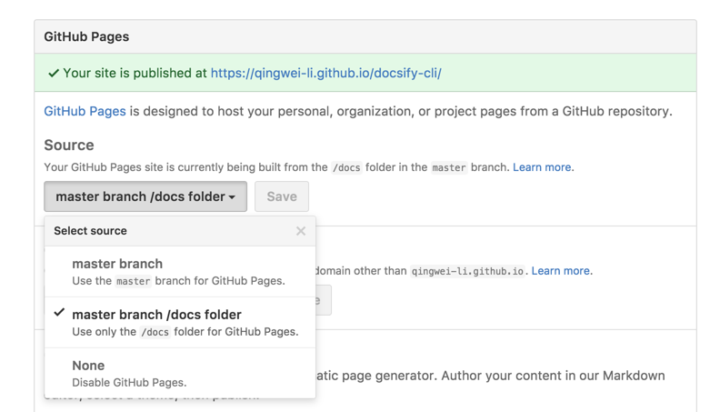

# this is my serverless personal wiki system

<!--测试一下 markdown上html注释好像满足-->
> 博客搭建阿里云的函数计算和docsify, 在开始之前希望你已经了解了阿里云Serverless函数计算，并确保你在电脑已经下载好了Funcraft和docsify-cli。在本地运行还需要下载docker**
```bash
// 安装funcraft
npm install @alicloud/fun -g
// 安装docsify-cli
npm i docsify-cli -g
```
> 使用阿里云Serverless函数计算搭建博客，template.yml文件的配置是比较需要关注的点，下面附上配置文档，方便随时查阅。
[template.yml配置文档](https://github.com/alibaba/funcraft/blob/master/docs/specs/2018-04-03-zh-cn.md?spm=a2c4g.11186623.2.27.5db0520dd7mf4c&file=2018-04-03-zh-cn.md)

**步骤1. 新建Serverless项目，选择http-trigger开头的node版本**
```bash
fun init -n blog-aliyun
```
**步骤2. 在blog-aliyun目录下用docsify建立博客系统**
```bash
cd blog-aliyun
// 建立博客系统
docsify init doc-blog
```
**步骤3 修改blog-aliyun目录下的index.js文件如下**
```javascript
'use strict'; 
const fs = require('fs')
const path = require('path')

exports.handler = async (request, response, callback) => {
  if (request.path === '/') {
    const uri = path.resolve(__dirname, './doc-blog/index.html');
    let html = fs.readFileSync(uri, {
      encoding: 'utf-8'
    })
    response.setStatusCode(200);
    response.setHeader('Content-Type', 'text/html');
    response.send(html);
  } else {
    const uri = path.resolve(__dirname, `./doc-blog/${request.path}`);
    const isExist = fs.existsSync(uri)
    if (isExist) {
      let fileContent = fs.readFileSync(uri, {
        encoding: 'utf-8'
      })
      response.send(fileContent);
    } else {
      response.send('');
    }
  }   
};
```

