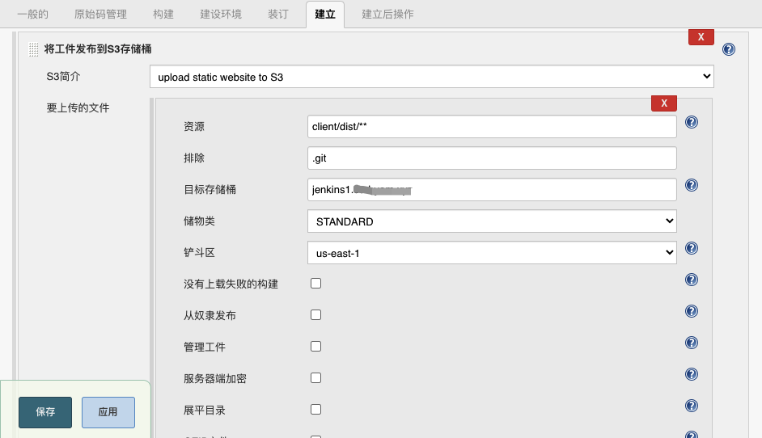
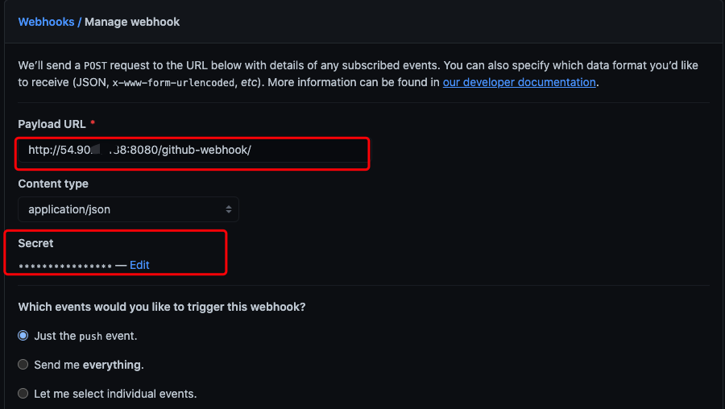
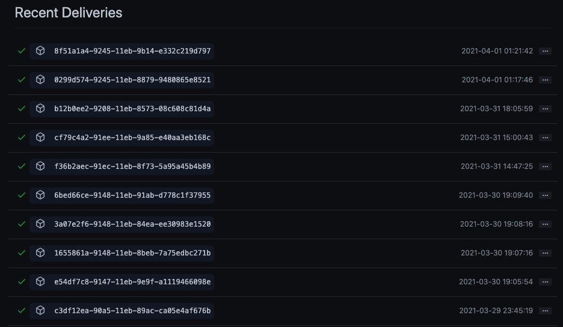

## Jenkins配置

**该Jenkins服务器使用AWS EC2，使用Docker进行安装，由于需要访问AWS S3存储桶，所以需要在该EC2服务器中添加可以访问AWS S3存储桶的IAM角色**

>源码管理：Repository URL为该项目的https形式的.git链接
>
>**（如果使用SSH形式需要在Credentials中添加密钥，需在配置管理中修改）**

---

>GitHub Webhook触发jenkins进行构建，需要去Github上进行配置。也可以选择定时构建或者轮询，定时去扫描代码有没有更新，和Crontab差不多。

---

>此界面为S3 Publisher插件(需要提前在插件管理Manage plugins进行安装),配置对应的Resource以及目标存储桶，配置完点击应用后可尝试构建。

---

>点击**立即构建**或者使用git提交代码时，可在jenkins管理页面中查看到构建记录。

---

## Github配置

**此图片为github-webhook配置**

>**Payload URL：**`http://(jenkins服务器IP):8080/github-webhook/ `
>
>端口主要看自己配置的端口，此处本人使用docker映射了`8080`端口

>**Secret：**Github的个人访问令牌(Personal access tokens) 
>
>**需要先去开发人员设置中创建，再把它添加到此处**

---

以上为最近的一些交付记录，Jenkins接受github发出的`POST`d请求后，就会触发构建。

>**详细配置后续更新“实现过程”文档进行步骤描述**