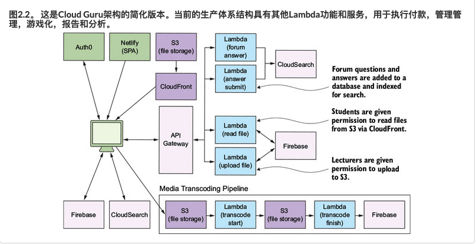

# 无服务器（Serverless）适用于哪些场景？

在现阶段，Serverless主要应用在以下几个场景。首先在Web及移动端服务中，可以整合API网关和Serverles服务构建Web及移动后端，帮助开发者构建可弹性扩展、高可用的移动或 Web后端应用服务。在IoT场景下可高效的处理实时流数据，由设备产生海量的实时信息流数据，通过Serverles服务分类处理并写入后端处理。另外在实时媒体资讯内容处理场景里，用户上传的音视频到对象存储OBS，通过上传事件触发多个函数，分别完成高清转码、音频转码等功能，满足用户对实时性和并发能力的高要求。无服务器计算还适合于任何事件驱动的各种不同的用例，这包括物联网，移动应用，基于网络的应用程序和聊天机器人等。这里简单说两个场景，方便大家思考。

**场景一：应用负载有显著的波峰波谷**

Serverless 应用成功与否的评判标准并不是公司规模的大小，而是其业务背后的具体技术问题，比如业务波峰波谷明显，如何实现削峰填谷。一个公司的业务负载具有波峰波谷时，机器资源要按照峰值需求预估；而在波谷时期机器利用率则明显下降，因为不能进行资源复用而导致浪费。

业界普遍共识是，当自有机器的利用率小于 30%，使用 Serverless 后会有显著的效率提升。对于云服务厂商，在具备了足够多的用户之后，各种波峰波谷叠加后平稳化，聚合之后资源复用性更高。比如，外卖企业负载高峰是在用餐时期，安防行业的负载高峰则是夜间，这是受各个企业业务定位所限的；而对于一个成熟的云服务厂商，如果其平台足够大，用户足够多，是不应该有明显的波峰波谷现象的。

**场景二：典型用例 - 基于事件的数据处理**

视频处理的后端系统，常见功能需求如下：视频转码、抽取数据、人脸识别等，这些均为通用计算任务，可由函数计算执行。

开发者需要自己写出实现逻辑，再将任务按照控制流连接起来，每个任务的具体执行由云厂商来负责。如此，开发变得更便捷，并且构建的系统天然高可用、实时弹性伸缩，用户不需要关心机器层面问题。

--------------------

### 阅读了Peter sbarski的《Serverless 架构 无服务器应用与AWS Lambda》书后，发现有更好的总结：

（简单摘抄一部分）http://book.acloud.guru/

无服务器技术和体系结构可用于构建整个系统，创建隔离的组件或实现特定的细粒度任务。无服务器设计的使用范围很大，其优点之一是可以将其用于大小任务。我们已经设计了无服务器系统，可以为成千上万的用户提供Web和移动应用程序，并且我们已经构建了简单的系统来解决特定的细微问题。值得记住的是，无服务器不仅仅是在Lambda等计算服务中运行代码。它还涉及使用第三方服务和API来减少您必须做的工作量。

## 1.1、 应用程序后端

在本书中，您将为类似YouTube的媒体共享应用构建后端。它将允许用户上传视频文件，将这些文件转码为不同的可播放格式，然后允许其他用户查看它们。您将为具有数据库和RESTful API的功能齐全的Web应用程序构建一个完全无服务器的后端。我们将展示无服务器技术适用于为各种Web，移动和桌面应用程序构建可扩展的后端。

- 身份验证与授权
- 通信网关
- 注册表（为每个设备分配唯一标识的方法）
- 设备跟踪（持久化的设备状态）
- 规则引擎（将设备信息转换和路由到AWS服务的服务）

## 1.2、 数据处理与操纵

无服务器技术的常见用途是数据处理，转换，操纵和代码转换。我们已经看到了其他开发人员为处理CSV，JSON和XML文件而构建的Lambda函数。整理和汇总数据；图像调整大小；和格式转换。Lambda和AWS服务非常适合为数据处理任务构建事件驱动的管道。

## 1.3、 实时分析

可以使用诸如Amazon Kinesis Streams之类的服务（例如，有关Kinesis的更多信息，请参阅[附录A](https://livebook.manning.com/book/serverless-architectures-on-aws/appendix-a/app01)）来完成数据的获取，例如日志，系统事件，交易或用户点击。Lambda函数可以对流中的新记录做出反应，并可以快速处理，保存或丢弃数据。可以将Lambda函数配置为在有特定数量（批量大小）的记录可用于处理时运行，这样就不必为添加到流中的每个单独的记录执行该函数。

## 1.4、 旧版API代理

Amazon API Gateway和Lambda（我们已经看过几次）的一个创新用例就是我们所说的旧版API代理。在这里，开发人员使用API Gateway和Lambda在旧版API和服务之上创建新的API层，以使其更易于使用。API网关用于创建RESTful接口，Lambda函数用于将请求/响应和封送数据转换为旧版服务可以理解的格式。对于不支持较旧协议和数据格式的现代客户端，此方法使旧服务更易于使用。

## 1.5、 预定服务

Lambda函数可以按计划运行，这使它们对重复任务有效，例如数据备份，导入和导出，提醒和警报。我们已经看到开发人员按计划使用Lambda函数来定期对其网站进行ping操作，以查看其是否在线，如果不在线，则发送电子邮件或短信。为此可以使用Lambda蓝图（*蓝图*是带有示例代码的模板，可以在创建新的Lambda函数时选择该模板）。而且我们已经看到开发人员编写Lambda函数来每晚从服务器上下载文件，并将每日帐户对帐单发送给用户。Lambda还可以轻松地完成重复的任务，例如文件备份和文件验证，这要归功于您可以设置和忘记的计划功能。

## 1.6、 机器人与技巧

Lambda函数和无服务器技术的另一种流行用法是为诸如Slack（一种流行的聊天系统，[https](https://slack.com/)：//slack.com）之类的服务构建机器人（*机器人*是运行自动化任务的应用或脚本）。为Slack开发的机器人可以响应命令，执行小任务以及发送报告和通知。例如，我们在Lambda中构建了一个Slack机器人，以报告通过我们的教育平台每天进行的在线销售数量。我们已经看到开发人员为Telegram，Skype和Facebook的Messenger平台构建了机器人。

同样，开发人员编写Lambda函数来增强Amazon Echo技能。Amazon Echo是一款免提扬声器，可响应语音命令。开发人员可以实施*技能*以进一步扩展Echo的功能（该技能本质上是一种可以响应人的声音的应用程序；有关更多信息，请参见http://amzn.to/2b5NMFj）。您可以编写技巧来订购披萨或在地理上测验自己。Amazon Echo完全由语音驱动，而*技能*由Lambda驱动。

图为acloud.guru的架构

Acloud.guru是一个学习AWS解决方案的网站，最初了解AWS也是从该网站开始做学习。网站功能包括视频课程，联系测试以及论坛讨论等。